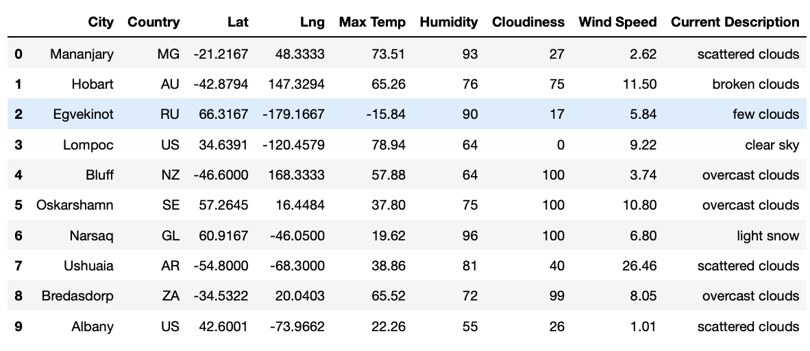

# World_Weather_Analysis
Module 6

# Project Overview

## Resources
Data Source: OpenWeatherMap API, Google Map Places API, Google Map Directions API

Software: Python 3.9.0, Anaconda Navigator 2.1.1, Jupyter Notebook 6.4.6

## Results 
### Deliverable 1: Retrieve Weather Data
Generate a set of 2,000 random latitudes and longitudes, perform an API call with the OpenWeatherMap and retrieve the following information from the API call:
- City and country
- Latitude and longitude
- Maximum temperature
- Percent humidity
- Percent cloudiness
- Wind speed
- Weather description

### Deliverable 2: Create a Customer Travel Destinations Map

### Deliverable 3: Create a Travel Itinerary Map
