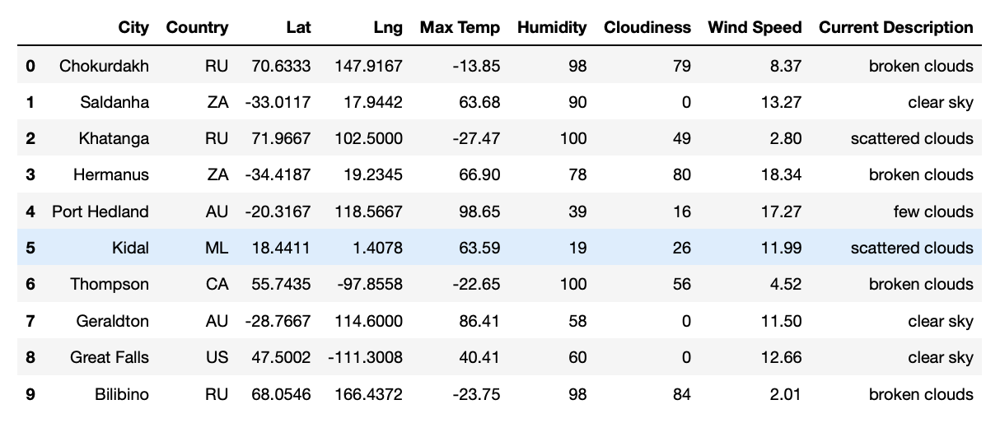

# World_Weather_Analysis
Module 6

# Project Overview
Jack loves the PlanMyTrip app. Beta testers love it too. And, as with any new product, they’ve recommended a few changes to take the app to the next level. Specifically, they recommend adding the weather description to the weather data you’ve already retrieved in this module. Then, you'll have the beta testers use input statements to filter the data for their weather preferences, which will be used to identify potential travel destinations and nearby hotels. From the list of potential travel destinations, the beta tester will choose four cities to create a travel itinerary. Finally, using the Google Maps Directions API, you will create a travel route between the four cities as well as a marker layer map.

## Basic Project Plan
-	*Task:* Collect and analyze weather data across cities worldwide.
-	*Purpose:* PlanMyTrip will use the data to recommend ideal hotels based on clients' weather preferences.
-	*Method:* Create a Pandas DataFrame with 2000 of the world's unique cities and their weather data in real time. This process will entail collecting, analyzing, and visualizing the data using the Google Maps Directions API and pop-up markers that can display information on specific cities based on a customer's travel preferences.

## Resources
Data Source: OpenWeatherMap API, Google Map Places API, Google Map Directions API

Software: Python 3.9.0, Anaconda Navigator 2.1.1, Jupyter Notebook 6.4.6

## Results 
### Deliverable 1: Retrieve Weather Data
Generate a set of 2,000 random latitudes and longitudes, perform an API call with the OpenWeatherMap and retrieve the following information from the API call:
- City and country
- Latitude and longitude
- Maximum temperature
- Percent humidity
- Percent cloudiness
- Wind speed
- Weather description

### Deliverable 2: Create a Customer Travel Destinations Map

### Deliverable 3: Create a Travel Itinerary Map
- Create a directions layer map

- Create a DataFrame that contains the four cities on the itinerary

- Create a new marker layer map of the cities on the travel route.

